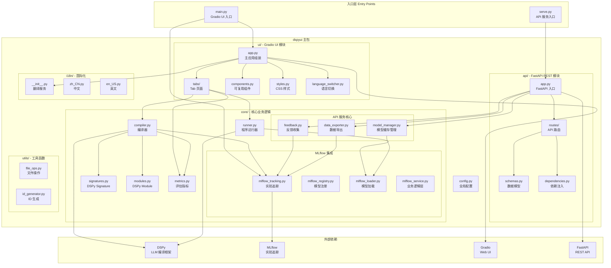
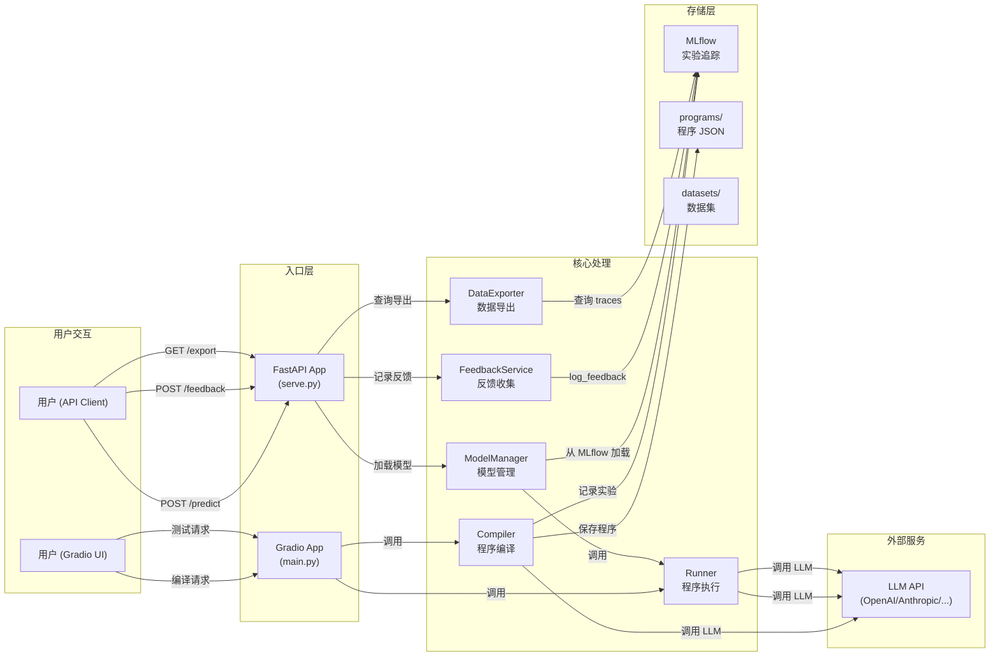
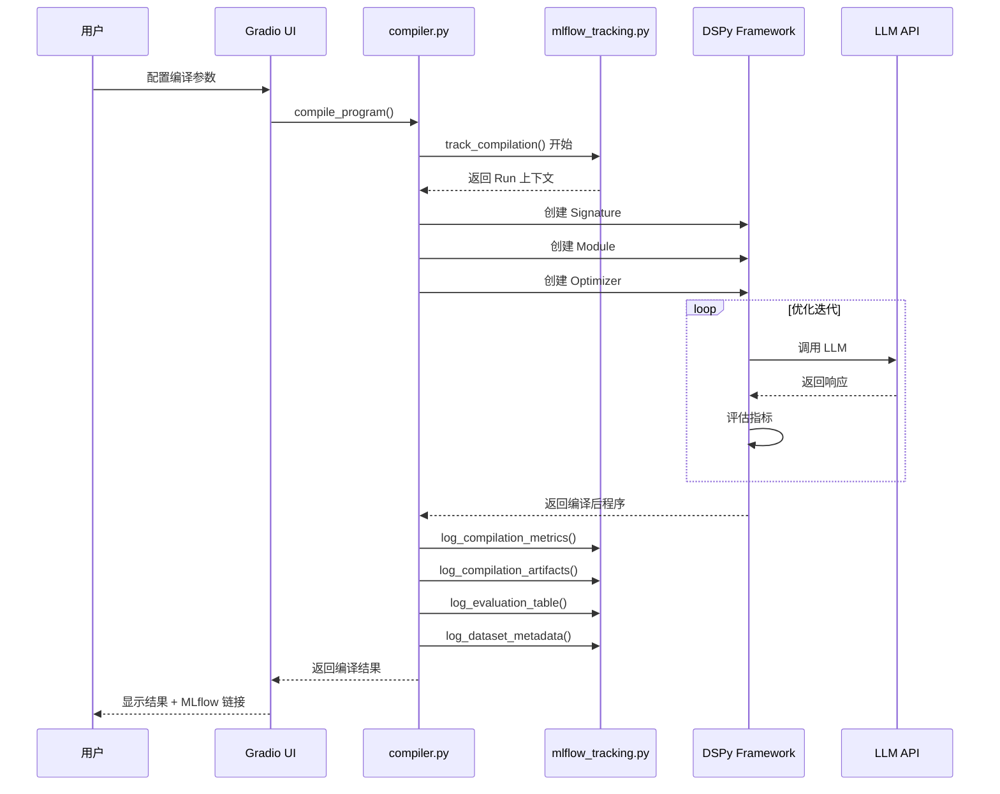
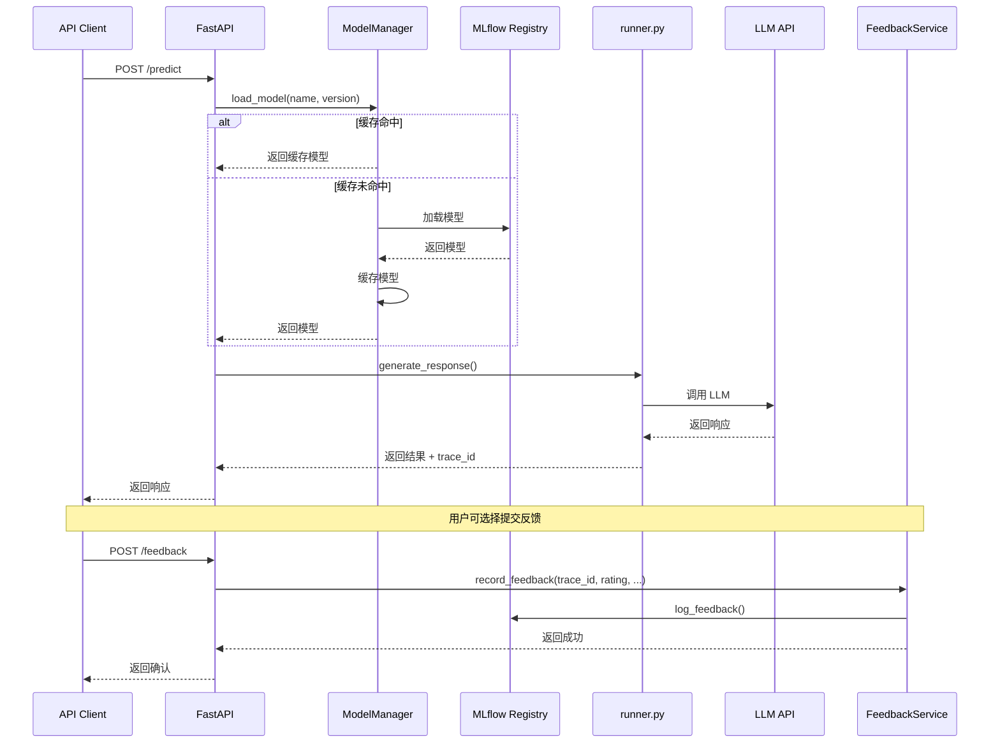
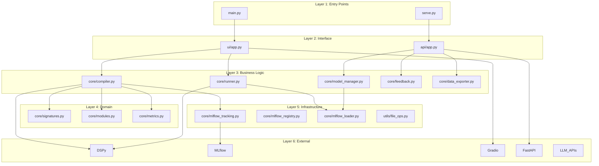
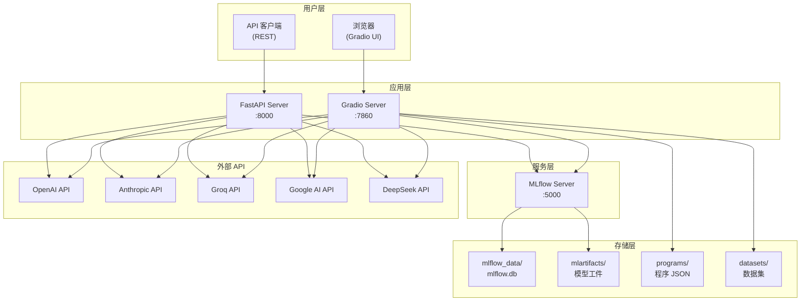

# DSPyUI 系统架构图

本文档使用 UML 图展示 DSPyUI 的整体架构设计。

## 1. 系统整体架构（包图）



## 2. 核心类图

```mermaid
classDiagram
    class ModelManager {
        -_cache: Dict
        -_cache_enabled: bool
        -_cache_ttl: int
        -_lock: threading.Lock
        +load_model(name, version, stage, alias) DSPyProgram
        +invalidate_cache(name) void
        +invalidate_all() void
        +get_cache_stats() Dict
    }
    
    class FeedbackService {
        -_feedback_enabled: bool
        +record_feedback(trace_id, rating, corrected_output, comment, user_id) FeedbackRecord
        +validate_trace_exists(trace_id) bool
    }
    
    class FeedbackRecord {
        +trace_id: str
        +rating: str
        +corrected_output: Optional[str]
        +comment: Optional[str]
        +user_id: Optional[str]
        +timestamp: datetime
    }
    
    class DataExporter {
        +query_traces_with_feedback(model_name, rating, start_date, end_date, limit) DataFrame
        +export_training_data(traces_df, format) bytes
        +export_streaming(model_name, rating, format, ...) Generator
    }
    
    class MLflowTracking {
        +init_mlflow() bool
        +track_compilation(experiment_name, run_name) ContextManager
        +log_compilation_metrics(baseline, evaluation, improvement) void
        +log_compilation_artifacts(program_json, dataset_csv) void
        +log_evaluation_table(results) void
        +log_dataset_metadata(row_count, columns, hash) void
        +register_model(run_id, model_name, metadata) ModelVersion
        +transition_model_stage(name, version, stage) void
        +get_mlflow_ui_url(run_id, experiment_id, model_name) str
    }
    
    class Compiler {
        +compile_program(signature, module_type, optimizer, dataset, metric, lm) CompiledProgram
    }
    
    class Runner {
        +generate_program_response(program_json, inputs) str
        +generate_response_from_mlflow(model_uri, inputs) str
        +run_batch_inference_from_mlflow(model_uri, csv_path) DataFrame
        +load_program_metadata(program_json) Dict
        +validate_csv_headers(csv_path, required_headers) bool
    }
    
    FeedbackService --> FeedbackRecord : creates
    ModelManager --> MLflowTracking : uses
    FeedbackService --> MLflowTracking : uses
    DataExporter --> MLflowTracking : uses
    Compiler --> MLflowTracking : uses
    Runner --> MLflowTracking : uses
```



## 3. API 路由结构

```mermaid
classDiagram
    class FastAPIApp {
        +lifespan: AsyncContextManager
        +state.model_manager: ModelManager
        +state.feedback_service: FeedbackService
        +state.data_exporter: DataExporter
    }
    
    class PredictRouter {
        +POST /predict
    }
    
    class FeedbackRouter {
        +POST /feedback
    }
    
    class ExportRouter {
        +GET /export
    }
    
    class ModelsRouter {
        +GET /models
        +GET /models/{name}
        +POST /models/{name}/cache/invalidate
    }
    
    class HealthRouter {
        +GET /health
        +GET /metrics
    }
    
    FastAPIApp --> PredictRouter
    FastAPIApp --> FeedbackRouter
    FastAPIApp --> ExportRouter
    FastAPIApp --> ModelsRouter
    FastAPIApp --> HealthRouter
    
    PredictRouter --> ModelManager : uses
    FeedbackRouter --> FeedbackService : uses
    ExportRouter --> DataExporter : uses
    ModelsRouter --> ModelManager : uses
```

## 4. 数据流图



## 5. 编译流程时序图



## 6. API 推理流程时序图



## 7. 模块依赖关系



## 8. 部署架构



## 总结

DSPyUI 采用分层架构设计：

| 层级 | 模块 | 职责 |
|------|------|------|
| 入口层 | `main.py`, `serve.py` | 应用启动入口 |
| 接口层 | `ui/`, `api/` | 用户交互界面 |
| 业务层 | `core/compiler.py`, `core/runner.py`, `core/model_manager.py` | 核心业务逻辑 |
| 领域层 | `core/signatures.py`, `core/modules.py`, `core/metrics.py` | DSPy 领域模型 |
| 基础设施层 | `core/mlflow_*.py`, `utils/` | 外部服务集成 |

两个主要入口：
1. **Gradio UI** (`main.py`) - 面向开发者的可视化编译和测试界面
2. **FastAPI API** (`serve.py`) - 面向生产环境的推理服务 API
